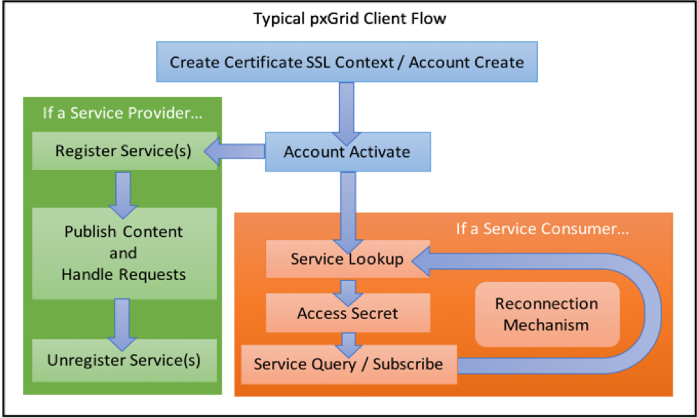
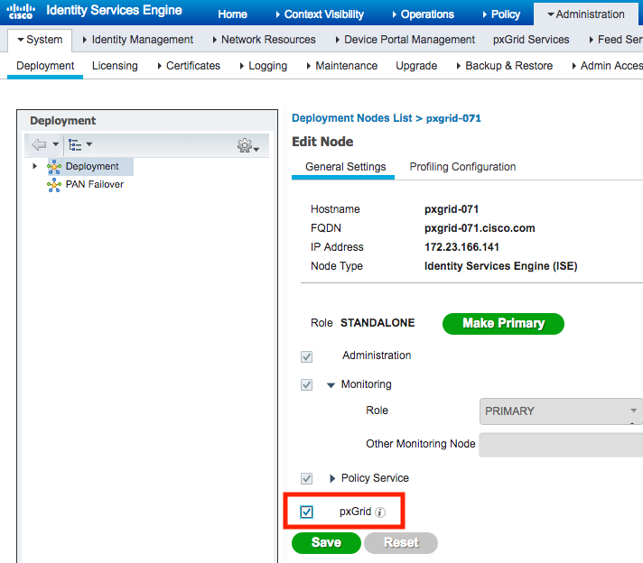
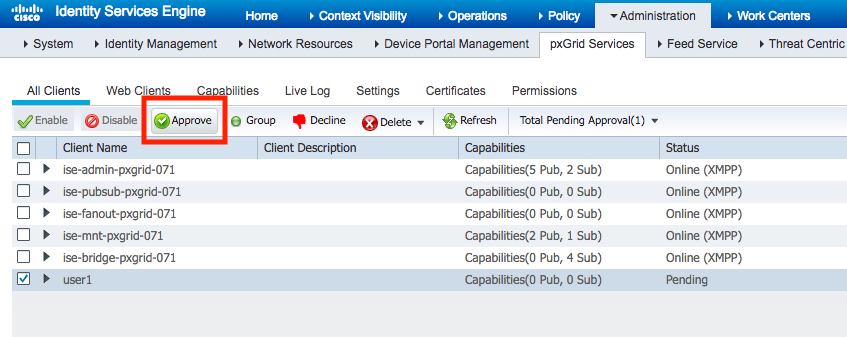

# Cisco ISE Email Notifications

## The Challenge

While enterprise customers usually have a SOC team monitoring the various security systems for alerts, not all customer have the resources for SOC or a centralized monitoring and event management systems.
These customers would prefer to use email notifications as an alerting mechanism for RADIUS failures on ISE. However, (currently) ISE does not have a built-in capability to send detailed email upon RADIUS failures, ISE can send an alert when the amount of failures cross a certain threshold.

With Cisco ISE's open APIs - that does not need to stop us.

## The Solution

This code will leverage ISE's pxGrid API to fetch RADIUS failures from ISE and send them via mail.
(#TODO - change the operation mode to `push` instead of `pull`)

## How to run the script on Docker:

There are several options for running this script:
1. Running the code on a computer/server with Python. Probably the easiest, but a waste of resources.
2. Running the code on a Docker container. Requires to <a href="https://docs.docker.com/get-docker/"> install Docker</a>.
3. Running the code on a Cisco device using Guestshell (Cisco Guestshell is a virtualized Linux-based environment, designed to run custom Linux applications, including Python for automated control and management of Cisco devices). See details below.

### High-level overview of the flow

pxGrid is a protocol framework of high level mechanisms that can be use with any type of transport protocol. 
It does not bind to any transport. The implementation of pxGrid protocol describe in this document is specific to Cisco ISE.
In other words, only the mechanism follows pxGrid protocol framework, the data formats and transports are specific to Cisco ISE.
The following provides a very high-level overview of a typical pxGrid client’s logical flow:
<p align="center"></p>

#### Using pxGrid as consumer
A consumer perform the following steps:
1. AccountCreate: Create a pxGrid account (if one does not exist), and retrieve a system generated password for the account.
2. AccountActivation: Activate once at consumer startup.
2. ServiceLookup: Locate the relevant node for the required action/data.
3. AccessSecret: Get a unique secret between 2 nodes.
4. Access the relevant data (using the relevant secret).

<a href="https://developer.cisco.com/docs/pxgrid/#!learning-pxgrid"> Reference to official documentation </a>

### Enable ISE ERS API

The ISE REST APIs - also known as External RESTful Services (ERS) - are disabled by default for security. You must enable it:
1. Login to your ISE PAN using the admin or other SuperAdmin user.
2. Navigate to Administration > System > Settings and select ERS Settings from the left panel.
4. Enable the ERS APIs by selecting Enable ERS for Read/Write
5. Do not enable CSRF unless you know how to use the tokens.
6. Select Save to save your changes.

Note: its good practice to disable CSRF to make sure you are able to authenticate successfully.

<a href="https://community.cisco.com/t5/security-documents/ise-ers-api-examples/ta-p/3622623#toc-hId--623796905"> Reference to official documentation </a>

### Enable pxGrid
1. Login to your ISE PAN using the admin or other SuperAdmin user.
2. Navigate to Administration > System > Deployment and select ERS Settings from the left panel.
<p align="center"></p>
3. Create a client certificate
    #TODO

### Set a environment variables file
```
ISE_IP= <ISE hostname/IP>
MAIL_USER= <SMTP username>
MAIL_PASS= <SMTP password>
MAIL_PORT= <SMTP TCP port, default is 465>
MAIL_DEST= <Email destinations>
PXGRID_USER= <pxGrid user, default is ise_to_mail>
```

### Create a Docker image
`docker build -t ise_to_mail .`

### Run the Docker
`docker run -d --env-file <path to env file> -v <path to data dir>:/Cisco-ISE-Email-Notifications/data ise_to_mail`

running the Docker in interactive mode:
`docker run -ti --env-file <path to env file> -v <path to data dir>:/Cisco-ISE-Email-Notifications/data ise_to_mail`

### Approve new pxGrid user
During the first run, the script will create a new pxGrid user (see environment variables). An ISE admin will need to Approve the new pxGrid user.
1. Login to your ISE PAN using the admin or other SuperAdmin user.
2. Navigate to Administration > pxGrid Services and select the new user.
4. Enable the user by selecting the "approve" button.
<p align="center"></p>

## How to run the script on Guestshell:
Cisco Guestshell is a virtualized Linux-based environment, designed to run custom Linux applications, including Python for automated control and management of Cisco devices.
Guestshell is available on many Cisco products including Catalyst 9000 series switches, Catalyst 9800 Wireless controllers, ISR 4000 series routers, ASR 1000 series routers, Catalyst 8000 series routers, Nexus 9000 series switches, etc'.

Running the code on guestshell is almost identical to running it on Docker. The only exception is the repeatable loop will be done by IOS-XE/NX-OS - ensuring the script will continue to run even after the device is rebooted/upgraded.

### Enable guestshell on the switch
Link to the <a href=https://www.cisco.com/c/en/us/td/docs/ios-xml/ios/prog/configuration/173/b_173_programmability_cg/guest_shell.html> Cisco configuration guide</a>.
Make sure python3 is available (`guestshell run python -V` or `guestshell run python3 -V`)
### Install the requests module
`pip install requests`
### First time preparation
1. Enter guestshell
2. Create a directory: `mkdir /bootflash/guest-share/ise_to_mail`
3. Create a directory: `mkdir /bootflash/guest-share/ise_to_mail/data`
4. Use `vi /bootflash/guest-share/ise_to_mail/run.py` to create a new python file, copy and paste the content of the `guestshell.py` file in the new file. **If you choose to keep the filename `guestshell`, make sure to adjust the EEM script below**
5. Use `vi /bootflash/guest-share/ise_to_mail/data/env.sh` to create an environment variables file.
6. Use `vi ~/.bashrc' to add 'source <path to env.sh>` that will use the env variables everytime guestshell starts.
7. Create an EEM applet that will run the script every 10 minutes:
    ```
    conf t
     event manager applet ise_to_mail
      event timer cron cron-entry "*/10 * * * *"
      action 1.0 cli command "enable"
      action 2.0 cli command "guestshell run python3 /bootflash/guest-share/ise_to_mail/run.py"
      action 3.0 syslog msg "Running the ISE_to_MAIL script"
    ```

## What to expect

### "failure" object

| Name          | Type          | Description   |
| ------------- | ------------- | ------------- |
| id            | string | |
| timestamp     | ISO8601 Datetime      | The time this record was created in ISE. |
| failureReason | string        | The reason for the authentication failure |
| userName      | string        | |
| serverName    | string | ISE server name where failure occured |
| callingStationId | string | Radius Calling-Station-ID |
| auditSessionId | string | |
| nasIpAddress  | string | |
| nasPortId | string | |
| nasPortType | string | |
| ipAddresses   | array of string | |
| macAddress | string | |
| messageCode | integer | |
| destinationIpAddress | string | |
| userType | string | |
| accessService | string | |
| identityStore | string | |
| identityGroup | string | |
| authenticationMethod | string | |
| authenticationProtocol | string | |
| serviceType | string | |
| networkDeviceName | string | |
| deviceType | string | |
| location | string | |
| selectedAznProfiles | string | |
| postureStatus | string | |
| ctsSecurityGroup | string | |
| response | string | |
| responseTime | integer | Time taken to response in millisecond |
| executionSteps | string | |
| credentialCheck | string | |
| endpointProfile | string | |
| mdmServerName | string | |
| policySetName | string | |
| authorizationRule | string | |
| mseResponseTime | time | |
| mseServerName | string | |
| originalCallingStationId | string | |

### Example
```
{
    'id': '1603571391695194',
    'accessService': 'Default Network Access',
    'authenticationMethod': 'PAP_ASCII',
    'authenticationProtocol': 'PAP_ASCII',
    'authorizationRule': 'VTY_Access',
    'callingStationId': '10.156.142.245',
    'credentialCheck': 'PAP_ASCII',
    'deviceType': 'All Device Types',
    'executionSteps': ['11001', '11017', '11117', '15049', '15008', '15041', '15048', '22072', '15013', '24210', '24212', '22037', '24715', '15036', '24432', '24325', '24313', '24369', '24322', '24352', '24708', '15048', '15048', '15048', '15016', '22081', '22080', '11002'],
    'identityGroup': 'User Identity Groups:NetAdmin',
    'identityStore': 'Internal Users',
    'location': 'All Locations',
    'messageCode': 5200,
    'nasIpAddress': '99.99.99.10',
    'nasName': 'Edge.lab.cisco.com',
    'nasPortId': 'tty2',
    'nasPortType': 'Virtual',
    'originalCallingStationId': '10.156.142.245',
    'policySetName': 'Default',
    'response': '{Class=CACS:0a388ef04VVqNxvE7EBPlsyYh02hC8caTDOu7tEORZIt0fQZA:ISE-SDA/392945955/2796; }',
    'responseTime': 20,
    'selectedAuthorizationProfiles': ['PermitAccess'],
    'serverName': 'ISE-SDA',
    'serviceType': 'Login',
    'timestamp': '2020-10-28T07:34:11.876Z',
    'userName': 'netadmin',
    'userType': 'User'
 }
 ```

----
### Licensing info
Copyright (c) 2020 Cisco and/or its affiliates.

This software is licensed to you under the terms of the Cisco Sample
Code License, Version 1.1 (the "License"). You may obtain a copy of the
License at

               https://developer.cisco.com/docs/licenses

All use of the material herein must be in accordance with the terms of
the License. All rights not expressly granted by the License are
reserved. Unless required by applicable law or agreed to separately in
writing, software distributed under the License is distributed on an "AS
IS" BASIS, WITHOUT WARRANTIES OR CONDITIONS OF ANY KIND, either express
or implied.
